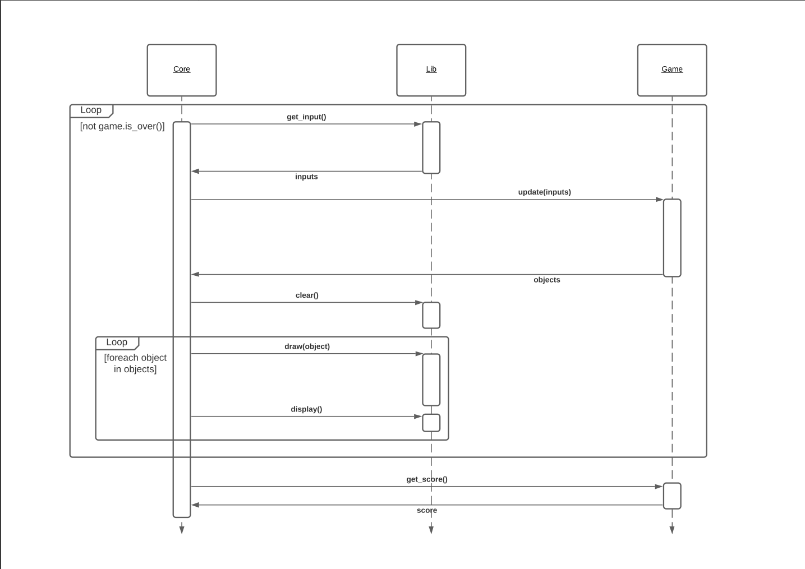

# Arcade

Arcade is a project realised in the 2nd year at Epitech, during the Object Oriented Programming module.

This program was realised by Alec Ferrari, Paul Narchal and Florian Chanson. Alec Ferrari was tasked to create the core of the program while Paul Narchal and Florian Chanson had to create bindings and games. Once the core finished, M. Ferrari joined the other to finish creating bindings and games.

The primary goal of the project is to create a virtual arcade machine. We are tasked to create bindings to different graphical libraries and use those bindings to run games separated from the core of the program. One of the fundamentals is that the core of the program shouldn't rely on anything else than itself to work. It shouldn't be dependent of the libraries or games available.

The programming goal of the project is to create an architecture and a program that is highly modular.
Indeed, one of the constraints put on the project is to make it compatible with another group's project. That is to say, they should be able to launch our games, we should be able to launch theirs. It means we had to agree upon an API that lets us create the games and the bindings we need while still having a fundamentally different core program.

See the [Class_arcade.pdf file](./doc/Class_arcade.pdf) to see the program's class diagram.

See the [Sequence_arcade.pdf file](./doc/Sequence_arcade.pdf) to see the program's sequence diagram.

## **Contributing to the arcade**

### *The Core's magic*

This project was created while bearing in mind that it can and shall include work from exterior developers. As such, scripts were created to help newcomers develop their own games and library bindings.

build.sh and clean.sh are self-explanatory. They launch the cmake and build the program and its libraries. Those two scripts shall always be used to build and clean the repository. Do not attempt building directly using cmake unless you really know what you're doing.

add_lib.sh and add_game.sh are used to add library bindings or new games to the arcade. They take as a first command-line argument the name of the item to be added. Each of these will create a skeleton of a basic lib or game that the programmer will fill to make it functional. The program should work on the get-go after using the scripts but the game or library won't do anything.

**The game loop has a time system, what's inside the while is called 60 times a second**

**Here is an extract from the sequence diagram of the program (in [Sequence_arcade.pdf](./doc/Sequence_arcade.pdf)):**



**Here is precisely how the code calls on the functions:**

```cpp
curr_lib->init();
curr_game->init();

while(!curr_game->is_over()) {
    std::vector<Input::Key> input = curr_lib->get_input();
    std::vector<arcade::GameObject> entity_list = curr_game->update(input);
    curr_lib->clear();
    for (auto &&entity : entity_list) {
        curr_lib->draw(entity);
    }
    curr_lib->display();
}
store_score(curr_game->get_score());

curr_game->stop();
curr_lib->stop();
```

### *Creating a library*

Creating a new library binding is fairly simple. Use the add_lib.sh script to prepare it, then fill in the derived class. Any new files you create should be added to the source of the library in the CMakeLists.txt.

The interface used to define and call libraries is the following (in arcade namespace, defined in IGraphicalLibrary.hpp):

```cpp
class IGraphicalLibrary {
    public:
        virtual ~IGraphicalLibrary(void) = default;
        virtual void init(void) = 0;
        virtual void stop(void) = 0;
        virtual const std::string &getName(void) const = 0;
        virtual void draw(GameObject &entity) = 0;
        virtual std::vector<Input::Key> get_input(void) = 0;
        virtual void display(void) = 0;
        virtual void clear(void) = 0;
};
```

Member by member:

- **Constructor**: It is automatically called once the library is loaded, that means at program startup. It shouldn't launch anything.

- **init and stop**: init is called right before the game loop. It should launch the library: creation of the window, setting up memory allocations if necessary etc. stop should undo what init did so that the library take up as little memory as possible. Any subsequent call to init will startup the library again, i.e. if init was first called, and stop then init are called, the library is reset. Stop will never be called before init.

- **getName**: This function returns a reference to a string to be displayed containing the name of the library. Be careful: it returns a reference and as such shouldn't return a local value (not `return "test";` but `return this->name;`).

- **draw**: Draw is given a reference to a GameObject to draw it on the screen. It shouldn't persist the changes on the screen yet, display will. This is to allow libraries such as sfml that have a display function not to call it on every draw. A GameObject is just a description of what should be drawn. Its different fields are filled accordingly to its `type` field. The different types are: Circle, Rectangle, Line, Sprite and Text. Sprite may require a bit of thinking to avoid creating and reloading the sprite each frame but a map storing the sources and their corresponding sprite should do the trick. See GameObject.hpp and GameObject.cpp for a correspondance type-field.

- **get_input**: This is fairly self-explanatory. The function should return all the keys pressed at the time of call in a std::vector. Usually a map mapping the library-specific keys to arcade::Input::Key keys should be used for translation. Due to std::map's look-up speed, this isn't a trouble.

- **display**: As mentionned before, this should persist any changes on the screen. It will be called each frame after all the draw calls.

- **clear**: This function should clear the screen. It is always called before the different draw calls by the Core.

### *Creating a game*

Creating a new game is fairly simple. Use the add_game.sh script to prepare it, then fill in the derived class. Any new files you create should be added to the source of the library in the CMakeLists.txt.

The interface used to define and use games is the following (in arcade namespace, defined in IGameModule.hpp):

```cpp
class IGameModule
{
    public:
        virtual ~IGameModule(void) = default;
        virtual const std::string &getName(void) const = 0;
        virtual void init(void) = 0;
        virtual void stop(void) = 0;
        virtual const std::vector<GameObject> &update(std::vector<Input::Key> input) = 0;
        virtual bool is_over(void) const = 0;
        virtual int get_score(void) const = 0;
};
```

Member by member:

- **getName**: This function returns a reference to a string to be displayed containing the name of the game. Be careful: it returns a reference and as such shouldn't return a local value (not `return "test";` but `return this->name;`).

- **init and stop**: init is called right before the game loop. It should launch the game: creation of the map, setting up memory allocations if necessary etc. stop should undo what init did so that the game take up as little memory as possible. Any subsequent call to init will startup the game again, i.e. if init was first called, and stop then init are called, the game is reset. Stop will never be called before init.

- **update**: update is called on each frame. It takes as a parameter a vector containing all the keys currently pressed. The function should then update the game's logic and finally return the vector containing all the GameObjects to draw. One GameObject contains its type as a member variable, and should be filled according to this type. Derived classes are available for each supported type. You should use them instead of their base class. They automatically set the object's type and take as a constructor parameter what is needed to build them.

- **is_over**: This function controls whether the game loop continues or stops it is called at each loop iteration. If this function returns true, the loop stops, get_score and stop are called and the menu is brought back up.

- **get_score**: This function should return the current game score. The score will be stored and a leaderboard of the best 5 will be kept. The function is called right before stop.

### *Testing a game or a library*

- If you chose to develop outside of the project, you should compile your game or lib and move or copy them into the `./lib` directory so that the Core can detect them.

- Testing a game is fairly simple: choose one of the available libraries and launch.

- Testing a library might be more hard if you stick with the available games. You should go to the [CMakeLists.txt file](./CMakeLists.txt) and uncomment the test_game target. This will allow the sample test game to compile and you'll be able to test your library.
